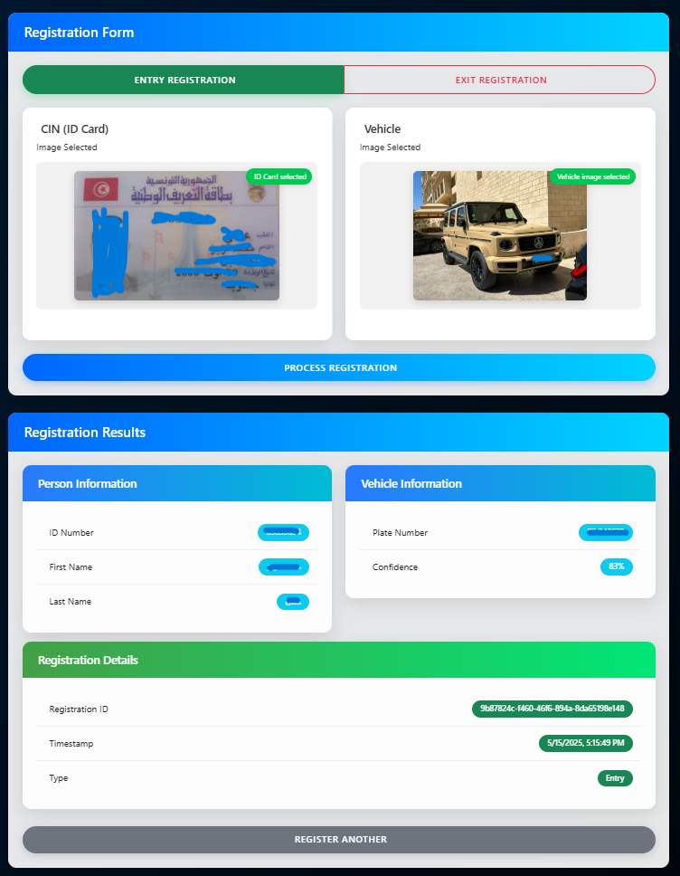
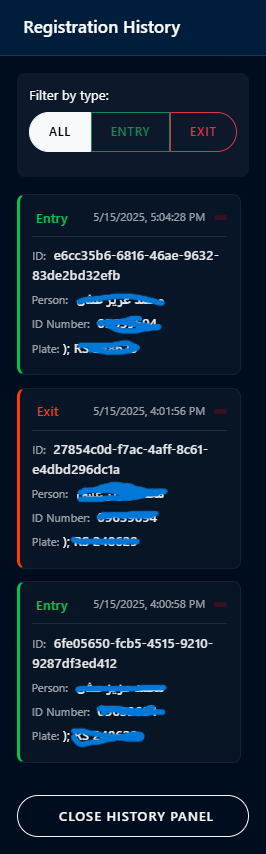

# Vehicle Entry/Exit Registration System

## Overview

The Vehicle Entry/Exit Registration System is a microservices-based platform designed to automate and secure the process of registering vehicles and individuals entering or exiting a facility. The system leverages modern technologies such as Node.js, Python, MongoDB, Kafka, gRPC, REST, and GraphQL to provide a robust, scalable, and extensible solution.

---

## Table of Contents
- [Features](#features)
- [Architecture](#architecture)
- [Component Breakdown](#component-breakdown)
- [Screenshots](#screenshots)
- [Setup & Installation](#setup--installation)
- [Usage](#usage)
- [Deployment to GitHub](#deployment-to-github)
- [Troubleshooting](#troubleshooting)
- [License](#license)

---

## Features
- **Automated vehicle and ID (CIN) scanning**
- **Microservices architecture** (Node.js, Python)
- **REST and GraphQL APIs**
- **gRPC for internal service communication**
- **Kafka-based event streaming**
- **MongoDB for persistent storage**
- **Web dashboard and database browser**
- **Extensive logging and diagnostics**

---

## Architecture

### High Level Architecture Diagram (Mermaid)


---

## Component Breakdown

### 1. **Gateway (API Gateway)**
- **Tech:** Node.js, Express, Apollo Server
- **Role:** Entry point for all client requests (REST/GraphQL). Handles authentication, validation, and routes requests to the aggregator or directly to MongoDB. Publishes registration events to Kafka.

### 2. **Aggregator Service**
- **Tech:** Node.js, gRPC
- **Role:** Orchestrates calls to CIN and Plate Detection services. Aggregates results and returns unified responses to the API Gateway.

### 3. **CIN Extraction Service**
- **Tech:** Python, gRPC, OpenVINO, EasyOCR
- **Role:** Extracts identity information from scanned ID card images.

### 4. **Plate Detection Service**
- **Tech:** Python, gRPC
- **Role:** Detects and recognizes vehicle license plates from images.

### 5. **Registration Consumer**
- **Tech:** Node.js, Kafka, MongoDB
- **Role:** Consumes registration events from Kafka and persists them in MongoDB. Handles error recovery and retries.

### 6. **MongoDB**
- **Role:** Stores all registration records, including vehicle, CIN, timestamps, and event types.

### 7. **Kafka Broker**
- **Role:** Event streaming backbone for decoupled, scalable communication between services.

---

## Screenshots

### Dashboard


### Scan Result


### Registration History


### Database Browser


---

## Setup & Installation

### Prerequisites
- **Windows OS**
- **Python 3.8+**
- **Node.js 14+**
- **MongoDB**
- **Kafka**

### 1. Clone the Repository
```powershell
git clone https://github.com/AymenMB/Vehicle-Entry-Exit-Registration-System---Microservices-.git
cd Vehicle-Entry-Exit-Registration-System---Microservices-
```

### 2. Install Dependencies & Setup Environment
Run the setup script to install all dependencies and prepare the environment:

**For CMD:**
```cmd
setup_environment.bat
```
**For PowerShell:**
```powershell
./setup_environment.ps1
```

This will:
- Create required directories
- Install Python and Node.js dependencies
- Generate gRPC code

### 3. Configure Environment Variables
Copy and edit the `.env` files in `api_gateway/` and `registration_consumer/` as needed (see `.env.example` if provided).

### 4. Start the System
**For CMD:**
```cmd
start_system.bat
```
**For PowerShell:**
```powershell
./start_system.ps1
```

### 5. Access the System
- Web UI: [http://localhost:3000](http://localhost:3000)
- GraphQL: [http://localhost:3000/graphql](http://localhost:3000/graphql)
- REST API: [http://localhost:3000/api](http://localhost:3000/api)

---

## Usage
- Scan a CIN card and vehicle plate using the web interface
- View registration history and statistics
- Browse the MongoDB database via the integrated browser
- Use REST or GraphQL APIs for programmatic access

---

## Deployment to GitHub

### 1. Prepare the Repository
- Ensure your `.gitignore` excludes all unnecessary files (see included `.gitignore`)
- Only commit source code, configuration, and documentation

### 2. Initialize and Push to GitHub
```bash
git init
git add .
git commit -m "Initial commit: Vehicle Entry/Exit Registration System"
git branch -M main
git remote add origin https://github.com/AymenMB/Vehicle-Entry-Exit-Registration-System---Microservices-.git
git push -u origin main
```

---

## Troubleshooting
- See `TROUBLESHOOTING.md` for common issues and solutions
- Check logs in the `logs/` directory for error details
- Use provided diagnostic scripts for environment checks

---

## License

This project is licensed under the MIT License - see the LICENSE file for details.

## System Architecture Details

### Data Flow

1. Client submits ID card and vehicle images through the web interface
2. API Gateway receives the request through REST or GraphQL endpoints
3. API Gateway forwards the request to the Aggregator
4. Aggregator sends the ID card image to the CIN Extraction Service via gRPC
5. Aggregator sends the vehicle image to the Plate Detection Service via gRPC
6. Both services process the images and return extracted data
7. Aggregator combines the results and returns them to the API Gateway
8. API Gateway formats the response and returns it to the client
9. API Gateway publishes the registration event to Kafka
10. Registration Consumer processes the Kafka event for analytics and storage

### Communication Protocols

- **Client ↔ API Gateway**: REST or GraphQL over HTTP
- **API Gateway ↔ Aggregator**: gRPC
- **Aggregator ↔ Microservices**: gRPC
- **API Gateway → Kafka**: Event publishing via Kafka protocol
- **Kafka → Registration Consumer**: Event consumption via Kafka protocol

---

## Getting Started

### Prerequisites

- Windows operating system
- Node.js 14+ (must be installed separately)
- Python 3.8+ (included in the aiplate_env)
- MongoDB 5.0+ (for database storage)
- `aiplate_env` Python virtual environment (included in the project)
- Docker and Docker Compose (recommended for Kafka, simplifies setup)
  OR
- Apache Kafka 3.0+ (alternative, requires manual installation)

### Kafka Setup

#### Option 1: Docker-based Kafka (Recommended)

1. **Install Docker Desktop** from [Docker's website](https://www.docker.com/products/docker-desktop/).

2. **Start Kafka using Docker**:
   ```batch
   kafka_docker.bat start
   ```

3. **Create required Kafka topics**:
   ```batch
   kafka_docker.bat create-topics
   ```

4. **View the Kafka UI** (optional): 
   Open http://localhost:8080 in your browser for a web interface to manage Kafka

5. **Check Kafka status**:
   ```batch
   kafka_docker.bat status
   ```

#### Option 2: Traditional Kafka Installation (Alternative)

For direct Kafka installation without Docker:

1. **Download Kafka** from the [official website](https://kafka.apache.org/downloads).

2. **Set KAFKA_HOME environment variable**:
   ```batch
   setx KAFKA_HOME "C:\kafka"
   ```

3. **Use the kafka_dev_tools script for Kafka management**:
   ```batch
   kafka_dev_tools.bat start
   kafka_dev_tools.bat create-topics
   ```

4. **Verify Kafka topics**:
   ```batch
   kafka_dev_tools.bat list-topics
   ```

### MongoDB Setup

#### Install MongoDB Community Edition

1. **Download MongoDB Community Server** from [MongoDB's website](https://www.mongodb.com/try/download/community).

2. **Run the installer** and choose the "Complete" installation option.

3. **Ensure "Install MongoDB as a Service" is checked** during installation.

4. **Run the MongoDB setup script** to create the database and collections:
   ```batch
   install_mongodb.bat
   ```
   
5. **Verify MongoDB installation**:
   ```powershell
   .\test_mongodb.ps1
   ```

### Installation

1. **Run the setup script** (this will configure the entire system):

For Windows CMD:
```batch
setup_environment.bat
```

For PowerShell:
```powershell
.\setup_environment.ps1
```

The setup script will:
- Activate the aiplate_env Python environment
- Install required Python packages in the environment
- Regenerate gRPC code
- Install Node.js dependencies for both services

2. **Verify installation with the diagnostic tool**:

For Windows CMD:
```batch
diagnostic.bat
```

For PowerShell:
```powershell
.\diagnostic.ps1
```
```bash
cd cin
python generate_cin_grpc.py
cd ../detect
python generate_grpc.py
cd ..
```

### Starting the System

You can use the provided setup script to install all dependencies in one step:
```bash
setup_environment.bat
```

Then run the system using the startup script:
```bash
start_system.bat
```

The startup script will:
1. Activate the aiplate_env environment
2. Start all microservices (CIN, Plate Detection, Aggregator, API Gateway, Kafka Consumer)
3. Open the system in your default web browser

Or start each component separately:

1. **Start the CIN Extraction Service**:
```bash
cd cin
..\aiplate_env\Scripts\activate
python cin_extraction_service.py
```

2. **Start the Plate Detection Service**:
```bash
cd detect
..\aiplate_env\Scripts\activate
python plate_detection_service.py
```

3. **Start the Aggregator Service**:
```bash
cd aggregator
npm start
```

4. **Start the Kafka Registration Consumer**:
```bash
cd registration_consumer
npm start
```

5. **Start the API Gateway**:
```bash
cd api_gateway
npm start
```

### Accessing the System

- Web Interface: http://localhost:3000
- REST API: http://localhost:3000/api/...
- GraphQL API: http://localhost:3000/graphql
- Kafka Events: Processed by the registration_consumer service

## API Documentation

### REST Endpoints

#### CIN Processing
- `POST /api/cin/extract`: Extract information from ID card image
  - Request: Form data with `image` field
  - Response: JSON with extracted data

#### Plate Detection
- `POST /api/plate/detect`: Detect license plate from vehicle image
  - Request: Form data with `image` field
  - Response: JSON with plate information

#### Registration
- `POST /api/register/entry`: Register vehicle entry
  - Request: Form data with `cinImage` and `vehicleImage` fields
  - Response: JSON with registration data

- `POST /api/register/exit`: Register vehicle exit
  - Request: Form data with `cinImage` and `vehicleImage` fields
  - Response: JSON with registration data

- `GET /api/status`: Get system status
  - Response: JSON with service status information

- `GET /api/kafka_status`: Get Kafka connection status
  - Response: JSON with Kafka status information

### GraphQL API

#### Queries
```graphql
query {
  healthCheck
}
```

#### Mutations
```graphql
mutation ExtractCIN($image: Upload!) {
  extractCinData(image: $image) {
    success
    idNumber
    name
    lastname
    confidenceId
    confidenceName
    confidenceLastname
    error
  }
}

mutation DetectPlate($image: Upload!) {
  detectPlate(image: $image) {
    success
    plateNumber
    confidence
    error
  }
}

mutation RegisterEntry($cinImage: Upload!, $vehicleImage: Upload!) {
  registerEntry(cinImage: $cinImage, vehicleImage: $vehicleImage) {
    success
    cinData {
      idNumber
      name
      lastname
    }
    plateData {
      plateNumber
      confidence
    }
    registrationId
    timestamp
    type
    error
  }
}

mutation RegisterExit($cinImage: $cinImage, $vehicleImage: $vehicleImage) {
  registerExit(cinImage: $cinImage, vehicleImage: $vehicleImage) {
    success
    cinData {
      idNumber
      name
      lastname
    }
    plateData {
      plateNumber
      confidence
    }
    registrationId
    timestamp
    type
    error
  }
}
```

### Kafka Topics

- **vehicle-registrations**: Main topic for vehicle entry/exit events
- **system-notifications**: Topic for system notifications
- **system-errors**: Topic for error events

## System Architecture Details

### Data Flow

1. Client submits ID card and vehicle images through the web interface
2. API Gateway receives the request through REST or GraphQL endpoints
3. API Gateway forwards the request to the Aggregator
4. Aggregator sends the ID card image to the CIN Extraction Service via gRPC
5. Aggregator sends the vehicle image to the Plate Detection Service via gRPC
6. Both services process the images and return extracted data
7. Aggregator combines the results and returns them to the API Gateway
8. API Gateway formats the response and returns it to the client
9. API Gateway publishes the registration event to Kafka
10. Registration Consumer processes the Kafka event for analytics and storage

### Communication Protocols

- **Client ↔ API Gateway**: REST or GraphQL over HTTP
- **API Gateway ↔ Aggregator**: gRPC
- **Aggregator ↔ Microservices**: gRPC
- **API Gateway → Kafka**: Event publishing via Kafka protocol
- **Kafka → Registration Consumer**: Event consumption via Kafka protocol

## Future Enhancements

1. Add database storage for registration records
2. Implement authentication/authorization
3. Add dashboard for historical data
4. Implement real-time notifications
5. Add Docker containerization

## License

This project is licensed under the MIT License - see the LICENSE file for details
